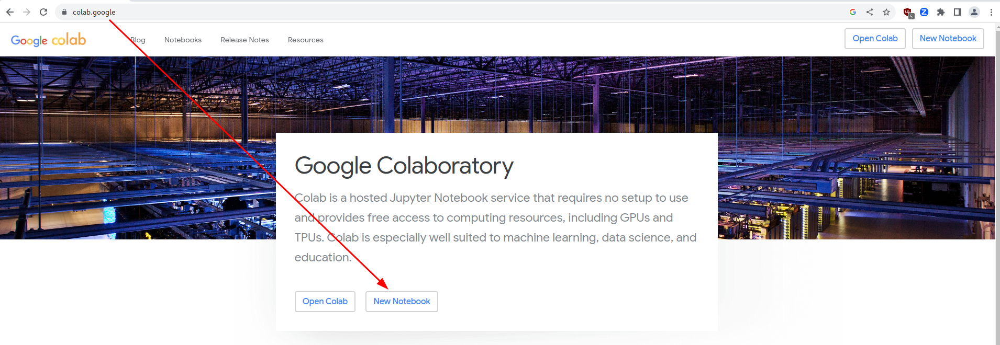
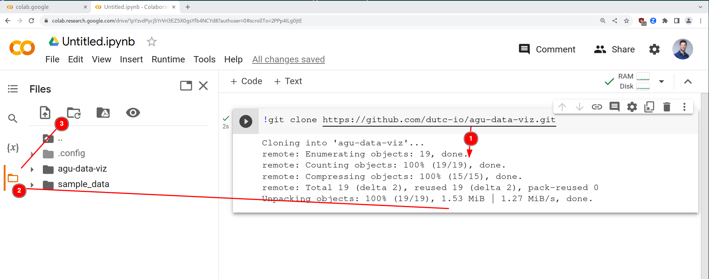

# How do I even get started with Data Visualization?
**[American Geophysical Union](https://www.agu.org/) in partnership with [Don’t Use This Code](https://dutc.io)**

*Wednesday, July 12, 2023 at 2pm US/Eastern*

Welcome to the workshop: “How do I even get started with Data Visualization”

In order to follow along with today’s presentation we have provided 2 options for you:

## 1. Google Colab

Google Colab is an online notebook-style editor for you to interactively run Python code in.
In order to get started with Google Colab, you will need to:

- Create a New Colab notebook
    - Navigate to https://colab.google and click on "New Notebook"
      

    - ① In an empty cell, execute the command: `!git clone https://github.com/dutc-io/agu-data-viz.git`
    - ② Navigate to the file tree explorer
    - ③ Refresh the file tree explorer to see the cloned repository
      

    - Click on the new folder `agu-data-viz` and open the `notes.ipynb` notebook.

## 2. Git & Anaconda

If you have working knowledge of `git` and `conda`, then you can locally clone the github repository and
create a conda virtual environment from the `environment.yml` file.

Start a new Terminal session and run the following commands

```bash
git clone https://github.com/dutc-io/agu-data-viz.git
cd agu-data-viz
conda env create -f environment.yml
conda activate agu-data-viz-02
```
